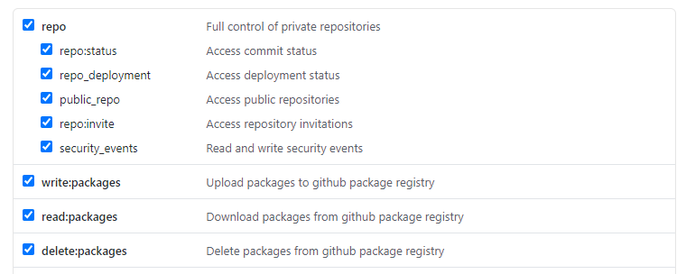

# GitHub Pull Request Extractor

The script `pulls.py` gets pull request data from the GitHub API and saves it to a local JSON file.
The JSON file maps pull request numbers to the files in the repo that the pull request edited.

## Requirements

* Python 3
* A functional [GitHub personal access token](https://docs.github.com/en/github/authenticating-to-github/creating-a-personal-access-token)
with the following scopes:



## Instructions

Checkout this repo, `cd` to its root, then run the following terminal commands:

```bash
virtualenv venv
source venv/bin/activate
pip install -r requirements.txt
```

Usage of the script is as follows:

```bash
python pulls.py <token> <repo_name> [--months <months>]
```

* `<token>` is your GitHub personal access token.
* `<repo_name>` is the full name of the repo you would like to extract e.g. `kiteco/pypulls`.
* You can optionally specifiy a number of `<months>` to extract data for. By default, this script will
extract the previous 12 months.

## Data

This script extracts PR's and the files that were changed in the PR's and saves it in a JSON object:

```javascript
{
  "1": [
    "file/changed/in/pr/1"
  ],
  "2": [
    "file/changed/in/pr/2",
    "another/file/changed/in/pr/2",
  ]
}
```

On macOS and Linux, this data is stored at `~/.kite/github/repo/name/pulls.json`. On Windows it is
stored at `%USERPROFILE\AppData\Local\Kite\github\repo\name\pulls.json`.
